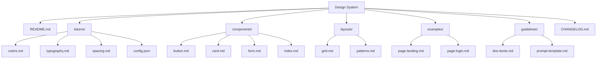

# Gray Design System

A comprehensive design system documentation for creating consistent, repeatable, and maintainable user interfaces. This system serves as the single source of truth for styling, layout, and components, optimized for LLM agent consumption.

## Overview

The Gray Design System is based on the elegant [Gray HTML](../gray-html) template by Cruip, adapted into a structured format that enables consistent UI generation through LLM agents. It provides atomic design tokens, component specifications, layout patterns, and usage guidelines to ensure visual consistency across all generated interfaces.

## Design Principles

- **Consistency First**: Every component and pattern follows established tokens and guidelines
- **Accessibility Compliant**: WCAG AA contrast ratios (>4.5:1) maintained throughout
- **Responsive by Default**: Mobile-first approach with defined breakpoints
- **Semantic & Clean**: Clear component hierarchy and naming conventions
- **LLM-Ready Documentation**: Structured for optimal machine readability and retrieval

## Quick Start for LLM Agents

Use this prompt template to generate consistent UI components:

```
Generate a [component_name] using the Gray Design System:
- Reference: design-system/tokens/
- Component Specs: design-system/components/[component_name].md
- Layout Patterns: design-system/layouts/
- Follow all spacing, color, typography, and component guidelines exactly
- Use the specified Tailwind classes from the token documentation
```

## System Structure



## Core Technologies

- **Framework**: HTML5 / Tailwind CSS v4.0
- **Typography**: Inter & Inter Tight (Google Fonts)
- **Color System**: OKLCH-based color scale
- **Icons**: Custom SVG implementations
- **Styling**: Utility-first with Tailwind CSS

## Version

**Current Version**: v1.0.0

## Documentation Guide

### For LLM Agents

1. **Always** reference the complete token system before generating components
2. **Never** deviate from specified class combinations or custom values
3. **Always** use the component specifications as the primary source of truth
4. **Check** the examples folder for full-page implementations
5. **Follow** the dos and don'ts guidelines in the guidelines folder

### For Developers

1. Explore the tokens folder to understand the atomic design values
2. Review component documentation for implementation specifics
3. Study examples to see components in context
4. Reference guidelines for best practices and accessibility

## Token System Overview

### Colors
- **Primary**: Zinc grayscale palette (50-950)
- **Semantic**: OKLCH-based with consistent lightness and chroma
- **Usage**: Strict mapping between colors and their purposes

### Typography
- **Primary Font**: Inter (body text, UI elements)
- **Display Font**: Inter Tight (headings, emphasized text)
- **Scale**: 8pt grid system with defined sizes (xs to 7xl)
- **Weights**: 400, 500, 600, 700

### Spacing
- **Base Unit**: 4px (Tailwind default)
- **Scale**: 0.25rem to 12rem increments
- **Usage**: Consistent margin and padding applications

### Components
- **Buttons**: Primary, secondary, tertiary variants with defined states
- **Forms**: Input fields, selects, textareas with consistent styling
- **Cards**: Container components with shadow and border systems
- **Navigation**: Header and footer patterns with responsive behavior

## Getting Started

### Installation

```bash
# The design system is documentation-based
# Reference the files directly or integrate with your build system

# For Tailwind CSS integration:
npm install tailwindcss @tailwindcss/forms
```

### Integration

```javascript
// tailwind.config.js
import tokens from './design-system/tokens/config.json';

export default {
  theme: {
    extend: {
      ...tokens,
      fontFamily: {
        sans: ['Inter', 'sans-serif'],
        tight: ['Inter Tight', 'sans-serif'],
      },
    },
  },
  plugins: [
    require('@tailwindcss/forms'),
  ],
};
```

## Examples

See the [examples](examples/) folder for complete page implementations:
- Landing page with hero section
- Login page with form components
- Request demo page

## Contributing

When contributing to this design system:
1. Update the appropriate token documentation
2. Provide clear examples of new components
3. Update CHANGELOG.md with version details
4. Maintain LLM readability in all documentation

## License

This design system is based on the Gray HTML template by [Cruip](https://cruip.com). See the original template for license details.

## Support

For questions about implementation or design decisions, refer to the [guidelines](guidelines/) folder or review the source template in [gray-html](../gray-html/).

---

**Note**: This design system is optimized for LLM consumption. Always reference the full documentation set when generating UI components to ensure consistency and correctness.