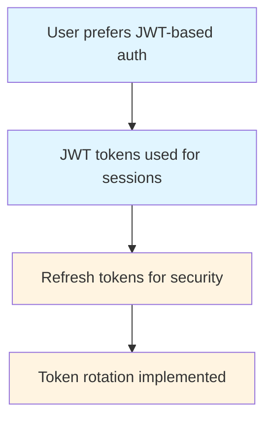

# te9.dev - Technical Documentation

Complete reference for all mechanics, commands, workflows, and configuration options in te9.dev.

## 📑 Table of Contents

- [Quick Reference](#quick-reference)
- [Core Concepts](#core-concepts)
- [Skills & Commands](#skills--commands)
- [Memory System (OpenMemory)](#memory-system-openmemory)
- [PRD-Driven Development](#prd-driven-development)
- [Design System Integration](#design-system-integration)
- [Testing & Quality Assurance](#testing--quality-assurance)
- [Git Workflow & Commits](#git-workflow--commits)
- [Configuration](#configuration)
- [MCP Integrations](#mcp-integrations)
- [Directory Structure](#directory-structure)
- [Advanced Workflows](#advanced-workflows)
- [Troubleshooting](#troubleshooting)

---

## Quick Reference

### Essential Commands

```bash
# Development workflow
skill("prd-interview")      # Start requirements gathering
skill("prd-plan")           # Plan large projects (optional)
skill("prd-create")         # Generate PRD files
skill("prd-work")           # Check PRD status & get guidance
skill("prd-execute")        # Implement work
skill("prd-test")           # Verify criteria
skill("prd-track")          # Log progress + approval workflow

# Memory operations
openmemory_openmemory_query()   # Get context
openmemory_openmemory_store()   # Save context

# UI Generation
uikit()              # Generate UIKit components
daisyui()            # Generate DaisyUI components
melt()               # Generate Melt UI components
```

### Critical Rules

- 🧪 **100% test pass rate required** - Zero tolerance for failures
- ✍️ **Each PRD gets its own commit** - PRD ID in commit message
- 👤 **User approval required for push** - Never auto-push
- 🧠 **Query memory before every response**
- 📝 **Never skip PRD** for development work

---

## Core Concepts

### The te9-method

te9.dev implements a structured development methodology that combines:

1. **PRD-Driven Development** - Every feature, bugfix, or refactor starts with a documented Product Requirements Document
2. **Memory-Powered Context** - AI agents maintain persistent context across sessions via OpenMemory
3. **Mandatory Testing** - All work must pass acceptance criteria AND unit tests (100% pass rate)
4. **Git Workflow Integration** - Each PRD creates its own commit with PRD ID in message
5. **Design System Adherence** - Consistent UI through the Gray Design System
6. **Complete Traceability** - Every decision, implementation, and change is logged

### Development Lifecycle

```
┌─────────────────────────────────────────────────────────────────┐
│                    PRD-DRIVEN DEVELOPMENT                      │
├─────────────────────────────────────────────────────────────────┤
│                                                               │
│  1. INTERVIEW  →  Gather requirements (9 questions)          │
│                                                               │
│  2. PLAN      →  Split into PRDs if >10 criteria or >500 words│
│                                                               │
│  3. CREATE    →  Generate PRD files in /dev/prd/runs/         │
│                                                               │
│  4. WORK CHECK →  Check status & get guidance                 │
│                                                               │
│  5. EXECUTE   →  Implement per acceptance criteria            │
│                  ├─ Test each criterion                      │
│                  ├─ Run unit tests (100% required) 🧪        │
│                  ├─ Create git commit ✍️                    │
│                  └─ Include PRD ID in message            │
│                                                               │
│  6. TEST      →  Verify all criteria + 100% test pass        │
│                                                               │
│  7. TRACK     →  Log completion + present commit for approval 👤│
│                  ├─ Ask user: "approve" or "reject"       │
│                  └─ Execute git push if approved ✅        │
│                                                               │
└─────────────────────────────────────────────────────────────────┘
```

### Work Types

te9.dev supports the following work types:

1. **New Project** - Creating entirely new application or system from scratch
2. **New Feature** - Adding new functionality to existing system
3. **Refactor** - Improving existing code structure or performance
4. **Bugfix** - Fixing identified issues or defects
5. **Other** - Infrastructure, documentation, research, or other work
6. **Single Prompt** - Skip PRD, execute immediately (non-development tasks)

---

## Skills & Commands

### PRD Interview

**Purpose**: Gather requirements through structured 9-question process

**Usage**:
```bash
skill("prd-interview")
```

**Questions Asked**:

1. **Work Type** - What type of work is this?
   - Options: New Project, New Feature, Refactor, Bugfix, Other, Single Prompt

2. **Title** - Short, descriptive title for the work

3. **Description** - Detailed explanation of what needs to be done

4. **Acceptance Criteria** - Specific, measurable criteria for completion
   - Format: List of bullet points
   - Each criterion must be testable
   - Example: "User can login with valid credentials", "Error message shown for invalid credentials"

5. **Priority** - How important is this work?
   - Options: Critical, High, Medium, Low, Backlog

6. **Dependencies** - What must be completed first?
   - Other PRDs
   - External systems
   - Resources

7. **Technology Stack** - What technologies will be used?

8. **Constraints** - Any limitations or restrictions?

9. **Notes** - Additional context or information

**Output**:
- Interview data stored in `/dev/interviews/`
- Data available for `prd-create` or `prd-plan`

### PRD Plan

**Purpose**: Split large projects into multiple PRDs (automatically triggered if >10 criteria or >500 words)

**Usage**:
```bash
skill("prd-plan", {
  interviewData: {...}  // From prd-interview
})
```

**When to Use**:
- Large projects (>10 acceptance criteria)
- Complex features (>500 words in description)
- Multiple components or systems

**Output**:
- Multiple PRD proposals
- Each PRD contains 3-7 acceptance criteria
- Clear dependencies between PRDs
- Implementation order recommended

### PRD Create

**Purpose**: Generate PRD files from interview data

**Usage**:
```bash
skill("prd-create", {
  interviewData: {...}  // From prd-interview or prd-plan
})
```

**Output**:
- PRD files created in `/dev/prd/runs/PRD-XXX/`
- Files included:
  - `PRD.md` - Complete PRD document
  - `config.json` - PRD configuration
  - `status.json` - Status tracking

**PRD Status States**:
- `TODO` - Not started
- `IN_PROGRESS` - Currently being worked on
- `DONE` - Completed successfully
- `FAILED` - Failed to complete
- `PAUSED` - Temporarily paused
- `BLOCKED` - Blocked by dependencies

### PRD Work

**Purpose**: Check PRD status and get guidance on next steps

**Usage**:
```bash
skill("prd-work")
```

**What It Does**:
- Checks current PRD status
- Identifies next steps
- Provides guidance on which skill to use
- Reports any issues or blockers

**When to Use**:
- At any point during development
- When unsure of next steps
- To check overall project status

### PRD Execute

**Purpose**: Implement work according to PRD acceptance criteria

**Usage**:
```bash
skill("prd-execute", {
  prdId: "PRD-XXX"
})
```

**Process**:
1. Reads PRD file
2. Implements each acceptance criterion
3. Tests each criterion individually
4. Runs unit tests (must pass 100%)
5. Creates git commit with PRD ID in message
6. Updates PRD status to `IN_PROGRESS`

**Critical Requirements**:
- 🧪 All unit tests must pass (100% pass rate)
- ✍️ Git commit must be created before completion
- 📝 Each criterion must be implemented
- 🔍 No regressions in existing functionality

### PRD Test

**Purpose**: Verify all acceptance criteria and ensure 100% test pass rate

**Usage**:
```bash
skill("prd-test", {
  prdId: "PRD-XXX"
})
```

**Verification Steps**:
1. Check all acceptance criteria are met
2. Run unit tests (must pass 100%)
3. Check for regressions
4. Verify git commit exists with PRD ID
5. Validate code quality
6. Test in real environment if applicable

**Failure Handling**:
- If tests fail: Return to `prd-execute` to fix
- If criteria incomplete: Return to `prd-execute` to complete
- If regressions found: Return to `prd-execute` to fix
- If commit missing: Create commit with PRD ID

**Success Criteria**:
- ✅ All acceptance criteria met
- ✅ 100% unit test pass rate
- ✅ No regressions detected
- ✅ Git commit created with PRD ID
- ✅ Code quality verified

### PRD Track

**Purpose**: Log progress, present commit for user approval, and push if approved

**Usage**:
```bash
skill("prd-track", {
  prdId: "PRD-XXX",
  eventType: "STARTED" | "PROGRESS" | "ISSUE" | "COMPLETED" | "FAILED",
  eventData: {...}  // Optional event-specific data
})
```

**Event Types**:

#### STARTED
```javascript
skill("prd-track", {
  prdId: "PRD-001",
  eventType: "STARTED",
  eventData: {
    timestamp: "2024-01-15T10:00:00Z",
    startedBy: "user"
  }
})
```

#### PROGRESS
```javascript
skill("prd-track", {
  prdId: "PRD-001",
  eventType: "PROGRESS",
  eventData: {
    achievement: "Implemented user registration",
    criteriaCompleted: [1, 2, 3],
    totalCriteria: 5,
    filesCreated: 3,
    filesModified: 2,
    percentageComplete: 60
  }
})
```

#### ISSUE
```javascript
skill("prd-track", {
  prdId: "PRD-001",
  eventType: "ISSUE",
  eventData: {
    issue: "Database timeout during user creation",
    severity: "Medium",
    resolution: "Increased connection pool timeout from 30s to 60s",
    timestamp: "2024-01-15T14:30:00Z"
  }
})
```

#### COMPLETED
```javascript
skill("prd-track", {
  prdId: "PRD-001",
  eventType: "COMPLETED",
  eventData: {
    completedAt: "2024-01-15T16:00:00Z",
    totalDuration: "6 hours",
    commitHash: "abc123def456",
    testResults: {
      total: 150,
      passed: 150,
      failed: 0,
      passRate: 100
    },
    criteriaMet: [1, 2, 3, 4, 5]
  }
})
```

**User Approval Workflow** (on COMPLETED):

```javascript
// System presents commit details to user
{
  prdId: "PRD-001",
  title: "User Authentication System",
  commitHash: "abc123def456",
  commitMessage: "feat: User Authentication System [PRD-001]\n\n- Implemented all acceptance criteria\n- All unit tests passing (100% pass rate)\n- No regressions detected\n- Code quality verified\n\nPRD: PRD-001\nType: New Feature\nPriority: High",
  filesChanged: 5,
  testResults: {
    total: 150,
    passed: 150,
    failed: 0
  },
  duration: "6 hours",
  
  // User response options
  approvalRequired: true,
  approvalOptions: ["approve", "reject"]
}

// If user types "approve":
skill("prd-track", {
  prdId: "PRD-001",
  eventType: "PUSH_APPROVED",
  eventData: {
    approvedBy: "user",
    approvedAt: "2024-01-15T16:05:00Z"
  }
})

// System executes git push
// Logs push success
// Updates PRD status to "DONE"

// If user types "reject":
skill("prd-track", {
  prdId: "PRD-001",
  eventType: "PUSH_DECLINED",
  eventData: {
    rejectedBy: "user",
    rejectedAt: "2024-01-15T16:05:00Z",
    reason: "Needs additional testing"
  }
})

// Commit stays local
// PRD status updated
// Can retry push later
```

#### FAILED
```javascript
skill("prd-track", {
  prdId: "PRD-001",
  eventType: "FAILED",
  eventData: {
    failedAt: "2024-01-15T17:00:00Z",
    reason: "Unable to resolve dependency conflicts",
    resolution: "Will retry after dependency updates"
  }
})
```

---

## Memory System (OpenMemory)

### Overview

OpenMemory provides persistent context across all AI interactions. It stores and retrieves information about your project, preferences, patterns, and decisions.

### Core Concepts

**Memory Sectors**:
- **Episodic** - Specific events, conversations, and interactions
- **Semantic** - Facts, codebase knowledge, technical details
- **Procedural** - How-to workflows, approaches, and patterns
- **Emotional** - User preferences, feelings, and opinions
- **Reflective** - Insights and patterns across interactions

**Temporal Validity** - Each memory has:
- Creation timestamp
- Expiration timestamp (optional)
- Validity period

**Salience Scores** - Each memory is scored 0-1 based on:
- Relevance to current context
- Frequency of access
- Recency of access
- User interaction feedback

### Memory Query

**Purpose**: Retrieve past context and relevant information

**Usage**:
```javascript
openmemory_openmemory_query({
  query: "user authentication patterns",
  user_id: "{{PROJECT_FOLDER_NAME}}",
  limit: 20
})
```

**Parameters**:

| Parameter | Type | Required | Description |
|-----------|------|----------|-------------|
| `query` | string | Yes | Search query or keywords |
| `user_id` | string | Yes | Project identifier (folder name) |
| `limit` | number | No | Maximum results (default: 20) |

**Returns**:
```javascript
{
  memories: [
    {
      id: "mem_1234567890",
      content: "User prefers JWT-based authentication with refresh tokens",
      sector: "emotional",
      tags: ["authentication", "jwt", "preferences"],
      createdAt: "2024-01-15T10:00:00Z",
      salience: 0.95,
      metadata: {
        confidence: 0.9,
        source: "interview",
        context: "PRD-001 discussion"
      }
    },
    // ... more memories
  ],
  total: 15,
  queryTime: "150ms"
}
```

**Best Practices**:
- Always query before responding to user
- Use specific keywords for better results
- Set reasonable limits (10-50)
- Analyze patterns across multiple results
- Use for contextualizing responses

### Memory Store

**Purpose**: Save important information, decisions, and learnings

**Usage**:
```javascript
openmemory_openmemory_store({
  content: "User prefers JWT-based authentication with refresh tokens. Refresh tokens expire after 7 days.",
  sector: "emotional",
  user_id: "{{PROJECT_FOLDER_NAME}}",
  tags: ["authentication", "jwt", "preferences", "PRD-001"]
})
```

**Parameters**:

| Parameter | Type | Required | Description |
|-----------|------|----------|-------------|
| `content` | string | Yes | Information to store |
| `sector` | string | Yes | Memory sector (episodic/semantic/procedural/emotional/reflective) |
| `user_id` | string | Yes | Project identifier (folder name) |
| `tags` | array | No | Keywords for retrieval (includes PRD-ID when applicable) |

**Returns**:
```javascript
{
  id: "mem_1234567890",
  createdAt: "2024-01-15T10:00:00Z",
  sector: "emotional",
  tags: ["authentication", "jwt", "preferences", "PRD-001"],
  status: "stored"
}
```

**Best Practices**:
- Store after important decisions
- Use descriptive tags (include PRD-ID)
- Choose appropriate sector
- Be specific and concise
- Store patterns, not just facts

### Memory Workflow

**Mandatory Memory Pattern**:

```javascript
// 1. QUERY FIRST - Before responding to user
const memories = openmemory_openmemory_query({
  query: "[relevant keywords from user request]",
  user_id: "{{PROJECT_FOLDER_NAME}}",
  limit: 20
})

// 2. ANALYZE - Review memories for patterns
// Identify relevant context, preferences, decisions

// 3. INCORPORATE - Adapt response based on memory
// Use stored information to personalize response

// ... respond to user ...

// 4. STORE LAST - After important interaction
openmemory_openmemory_store({
  content: "[decision, learning, or important information]",
  sector: "[appropriate sector]",
  user_id: "{{PROJECT_FOLDER_NAME}}",
  tags: ["PRD-001", "feature-name", "user-story", "work-type"]
})
```

**When to Store**:
- After PRD interview completion
- After architectural decisions
- After bug fixes (root cause and resolution)
- After user preference expressions
- After pattern discoveries
- After completion of work

**What to Store**:
- User preferences and opinions
- Architectural decisions and rationale
- Bug root causes and resolutions
- Performance optimizations
- Code patterns that work well
- Project-specific conventions
- Integration quirks and workarounds

---

## PRD-Driven Development

### Complete Workflow

#### Step 1: Interview

```bash
skill("prd-interview")
```

**What Happens**:
- AI asks 9 structured questions
- User provides answers
- Interview data is validated
- Data stored in `/dev/interviews/`

**Output**:
```json
{
  "interviewId": "interview_20240115_001",
  "timestamp": "2024-01-15T10:00:00Z",
  "responses": {
    "workType": "New Feature",
    "title": "User Authentication System",
    "description": "Implement JWT-based authentication...",
    "acceptanceCriteria": [
      "User can register with email and password",
      "User can login with valid credentials",
      "Error message shown for invalid credentials",
      "Session persists via JWT tokens",
      "Refresh tokens implemented for security"
    ],
    "priority": "High",
    "dependencies": ["Database schema ready"],
    "technology": ["Node.js", "Express", "JWT", "bcrypt"],
    "constraints": ["Must support OAuth in future"],
    "notes": "User prefers refresh token approach"
  }
}
```

#### Step 2: Plan (if needed)

**Triggered automatically if**:
- >10 acceptance criteria, OR
- >500 words in description, OR
- Multiple distinct components

```bash
skill("prd-plan", {
  interviewData: {...}  // From interview
})
```

**Output**:
```json
{
  "planId": "plan_20240115_001",
  "totalPRDs": 3,
  "prds": [
    {
      "prdId": "PRD-001",
      "title": "User Registration",
      "acceptanceCriteria": [
        "User can register with email and password",
        "Password hashed with bcrypt",
        "Email validation implemented"
      ],
      "dependencies": [],
      "order": 1
    },
    {
      "prdId": "PRD-002",
      "title": "User Login",
      "acceptanceCriteria": [
        "User can login with valid credentials",
        "JWT tokens generated on successful login",
        "Error message shown for invalid credentials"
      ],
      "dependencies": ["PRD-001"],
      "order": 2
    },
    {
      "prdId": "PRD-003",
      "title": "Refresh Token System",
      "acceptanceCriteria": [
        "Refresh tokens implemented",
        "Token rotation on refresh",
        "Refresh token validation"
      ],
      "dependencies": ["PRD-002"],
      "order": 3
    }
  ]
}
```

#### Step 3: Create

```bash
skill("prd-create", {
  interviewData: {...}  // From interview or plan
})
```

**Output Files**:
```
/dev/prd/runs/PRD-001/
├── PRD.md              # Complete PRD document
├── config.json         # PRD configuration
└── status.json         # Status tracking
```

**PRD.md Structure**:
```markdown
# PRD-001: User Authentication System

## Overview
[Description]

## Acceptance Criteria
1. [Criterion 1]
2. [Criterion 2]
...

## Priority
High

## Dependencies
[Dependencies]

## Technology Stack
[Technologies]

## Constraints
[Constraints]

## Notes
[Additional context]
```

**config.json Structure**:
```json
{
  "prdId": "PRD-001",
  "title": "User Authentication System",
  "status": "TODO",
  "createdAt": "2024-01-15T10:00:00Z",
  "updatedAt": "2024-01-15T10:00:00Z",
  "acceptanceCriteria": [
    {
      "id": 1,
      "description": "User can register with email and password",
      "status": "pending",
      "tested": false
    },
    // ...
  ],
  "priority": "High",
  "dependencies": [],
  "technology": ["Node.js", "Express", "JWT", "bcrypt"],
  "constraints": ["Must support OAuth in future"]
}
```

#### Step 4: Work Check (Recommended)

```bash
skill("prd-work")
```

**Output**:
```json
{
  "currentPRD": "PRD-001",
  "status": "TODO",
  "nextStep": "Execute",
  "recommendedCommand": "skill('prd-execute', {prdId: 'PRD-001'})",
  "blockingIssues": [],
  "progress": {
    "completedCriteria": 0,
    "totalCriteria": 5,
    "percentage": 0
  }
}
```

#### Step 5: Execute

```bash
skill("prd-execute", {
  prdId: "PRD-001"
})
```

**What Happens**:
1. Reads PRD.md and config.json
2. Implements each acceptance criterion
3. Tests each criterion
4. Runs unit tests (must pass 100%)
5. Creates git commit with PRD ID in message
6. Updates status.json
7. Stores progress in OpenMemory

**Git Commit Format**:
```bash
git commit -m "feat: User Authentication System [PRD-001]

- Implemented all acceptance criteria
- User can register with email and password
- User can login with valid credentials
- Error message shown for invalid credentials
- JWT tokens generated on successful login
- Refresh tokens implemented for security

All unit tests passing (100% pass rate)
No regressions detected
Code quality verified

PRD: PRD-001
Type: New Feature
Priority: High"
```

**Critical Checks**:
- ✅ All unit tests must pass (100%)
- ✅ No regressions in existing tests
- ✅ Git commit created with PRD ID
- ✅ All acceptance criteria implemented
- ✅ Code quality verified

**If Tests Fail**:
1. Identify failing tests
2. Fix implementation
3. Re-run tests
4. Repeat until 100% pass rate
5. Update commit if needed

**Status Update**:
```json
{
  "prdId": "PRD-001",
  "status": "IN_PROGRESS",
  "updatedAt": "2024-01-15T12:00:00Z",
  "progress": {
    "completedCriteria": 5,
    "totalCriteria": 5,
    "percentage": 100
  },
  "commit": {
    "hash": "abc123def456",
    "message": "feat: User Authentication System [PRD-001]",
    "createdAt": "2024-01-15T12:00:00Z"
  },
  "testResults": {
    "total": 150,
    "passed": 150,
    "failed": 0,
    "passRate": 100
  }
}
```

#### Step 6: Test

```bash
skill("prd-test", {
  prdId: "PRD-001"
})
```

**Verification Process**:

1. **Check Acceptance Criteria**
   ```javascript
   // Verify each criterion is met
   criteriaMet.forEach(criterion => {
     if (!testCriterion(criterion)) {
       throw new Error(`Criterion not met: ${criterion}`);
     }
   });
   ```

2. **Run Unit Tests**
   ```bash
   npm test
   # Must return 0 exit code (all tests pass)
   ```

3. **Check for Regressions**
   ```javascript
   // Compare with baseline
   const baseline = getBaselineTests();
   const current = getCurrentTests();
   ensureNoRegressions(baseline, current);
   ```

4. **Verify Git Commit**
   ```bash
   git log --oneline --grep="PRD-001"
   # Must find commit with PRD-001 in message
   ```

5. **Validate Code Quality**
   ```bash
   npm run lint
   # Must pass all linting rules
   ```

**Success Output**:
```json
{
  "prdId": "PRD-001",
  "status": "READY_FOR_TRACKING",
  "verificationResults": {
    "acceptanceCriteria": {
      "total": 5,
      "met": 5,
      "notMet": 0,
      "percentage": 100
    },
    "unitTests": {
      "total": 150,
      "passed": 150,
      "failed": 0,
      "passRate": 100
    },
    "regressions": {
      "detected": 0
    },
    "gitCommit": {
      "exists": true,
      "hash": "abc123def456",
      "includesPRDId": true
    },
    "codeQuality": {
      "lintPassed": true,
      "issues": 0
    }
  }
}
```

**Failure Output**:
```json
{
  "prdId": "PRD-001",
  "status": "FAILED_VERIFICATION",
  "verificationResults": {
    "acceptanceCriteria": {
      "total": 5,
      "met": 4,
      "notMet": 1,
      "notMetDetails": [
        {
          "criterion": "Refresh tokens implemented for security",
          "reason": "Not fully implemented"
        }
      ]
    },
    "unitTests": {
      "total": 150,
      "passed": 145,
      "failed": 5,
      "passRate": 96.7,
      "failedTests": [
        "test_refresh_token_validation",
        "test_token_rotation",
        // ...
      ]
    }
  },
  "actionRequired": "Return to prd-execute to fix issues"
}
```

#### Step 7: Track

```bash
skill("prd-track", {
  prdId: "PRD-001",
  eventType: "COMPLETED"
})
```

**User Approval Presentation**:
```json
{
  "prdId": "PRD-001",
  "title": "User Authentication System",
  "status": "COMPLETED",
  "completedAt": "2024-01-15T12:00:00Z",
  "duration": "2 hours",
  
  "commit": {
    "hash": "abc123def456",
    "message": "feat: User Authentication System [PRD-001]\n\n- Implemented all acceptance criteria\n- All unit tests passing (100% pass rate)\n- No regressions detected\n- Code quality verified\n\nPRD: PRD-001\nType: New Feature\nPriority: High"
  },
  
  "filesChanged": 5,
  "filesAdded": 3,
  "filesModified": 2,
  
  "testResults": {
    "total": 150,
    "passed": 150,
    "failed": 0,
    "passRate": 100
  },
  
  "acceptanceCriteria": {
    "total": 5,
    "met": 5,
    "percentage": 100
  },
  
  "approvalRequired": true,
  "message": "This PRD has completed successfully. Review the commit details above and type 'approve' to push to remote, or 'reject' to keep the commit local.",
  "approvalOptions": ["approve", "reject"]
}
```

**If User Approves**:
```bash
# System executes:
git push origin main

# System logs:
skill("prd-track", {
  prdId: "PRD-001",
  eventType: "PUSH_SUCCESSFUL",
  eventData: {
    pushedAt: "2024-01-15T12:05:00Z",
    pushedBy: "user",
    remoteBranch: "main"
  }
})

# System updates status:
{
  "prdId": "PRD-001",
  "status": "DONE",
  "pushedAt": "2024-01-15T12:05:00Z",
  "workflowComplete": true
}

# System stores in OpenMemory:
openmemory_openmemory_store({
  content: "PRD-001 User Authentication System completed successfully. Implemented JWT-based auth with refresh tokens. All 5 acceptance criteria met. 150 unit tests passing (100% pass rate). Git push approved by user.",
  sector: "procedural",
  user_id: "{{PROJECT_FOLDER_NAME}}",
  tags: ["PRD-001", "authentication", "jwt", "completed"]
})
```

**If User Rejects**:
```bash
# System logs:
skill("prd-track", {
  prdId: "PRD-001",
  eventType: "PUSH_DECLINED",
  eventData: {
    rejectedAt: "2024-01-15T12:05:00Z",
    rejectedBy: "user",
    reason: "Provided by user"
  }
})

# System updates status:
{
  "prdId": "PRD-001",
  "status": "PUSH_DECLINED",
  "commitLocal": true,
  "workflowComplete": true
}

# Commit remains local, can be pushed later with manual git push
```

---

## Design System Integration

### Gray Design System

**Purpose**: Comprehensive, LLM-optimized design system for consistent, accessible UI

**Directory Structure**:
```
dev/design-system/
├── tokens/
│   ├── colors.md          # Color palette (zinc 50-950, semantic colors)
│   ├── typography.md      # Font sizes, weights, line heights
│   ├── spacing.md         # Spacing scale (4px base unit)
│   └── shadows.md         # Shadow tokens
├── components/
│   ├── button.md          # Button variants and states
│   ├── card.md            # Card components
│   ├── form.md            # Form elements
│   └── [more components]
├── layouts/
│   ├── grid.md            # 12-column grid system
│   ├── hero.md            # Hero sections
│   └── features.md        # Feature sections
├── examples/
│   └── [Complete implementations]
└── guidelines/
    ├── accessibility.md   # WCAG AA guidelines
    ├── responsiveness.md  # Mobile-first approach
    └── best-practices.md  # Design system best practices
```

**Token System**:

**Colors**:
```css
/* Zinc Palette */
--zinc-50: #fafafa;
--zinc-100: #f4f4f5;
--zinc-200: #e4e4e7;
--zinc-300: #d4d4d8;
--zinc-400: #a1a1aa;
--zinc-500: #71717a;
--zinc-600: #52525b;
--zinc-700: #3f3f46;
--zinc-800: #27272a;
--zinc-900: #18181b;
--zinc-950: #09090b;

/* Semantic Colors */
--primary: #3b82f6;      /* Blue */
--primary-hover: #2563eb;
--secondary: #64748b;    /* Slate */
--success: #10b981;      /* Emerald */
--warning: #f59e0b;      /* Amber */
--danger: #ef4444;       /* Red */
```

**Typography**:
```css
/* Font Families */
--font-sans: 'Inter', sans-serif;
--font-tight: 'Inter Tight', sans-serif;

/* Font Sizes (8pt grid) */
--text-xs: 0.75rem;      /* 12px */
--text-sm: 0.875rem;     /* 14px */
--text-base: 1rem;       /* 16px */
--text-lg: 1.125rem;     /* 18px */
--text-xl: 1.25rem;      /* 20px */
--text-2xl: 1.5rem;      /* 24px */
--text-3xl: 1.875rem;    /* 30px */
--text-4xl: 2.25rem;     /* 36px */
--text-5xl: 3rem;        /* 48px */
--text-6xl: 3.75rem;     /* 60px */
```

**Spacing** (4px base unit):
```css
--space-1: 0.25rem;  /* 4px */
--space-2: 0.5rem;   /* 8px */
--space-3: 0.75rem;  /* 12px */
--space-4: 1rem;     /* 16px */
--space-5: 1.25rem;  /* 20px */
--space-6: 1.5rem;   /* 24px */
--space-8: 2rem;     /* 32px */
--space-10: 2.5rem;  /* 40px */
--space-12: 3rem;    /* 48px */
--space-16: 4rem;    /* 64px */
--space-20: 5rem;    /* 80px */
--space-24: 6rem;    /* 96px */
```

**Shadows**:
```css
--shadow-xs: 0 1px 2px 0 rgb(0 0 0 / 0.05);
--shadow-sm: 0 1px 3px 0 rgb(0 0 0 / 0.1), 0 1px 2px -1px rgb(0 0 0 / 0.1);
--shadow-md: 0 4px 6px -1px rgb(0 0 0 / 0.1), 0 2px 4px -2px rgb(0 0 0 / 0.1);
--shadow-lg: 0 10px 15px -3px rgb(0 0 0 / 0.1), 0 4px 6px -4px rgb(0 0 0 / 0.1);
--shadow-xl: 0 20px 25px -5px rgb(0 0 0 / 0.1), 0 8px 10px -6px rgb(0 0 0 / 0.1);
--shadow-2xl: 0 25px 50px -12px rgb(0 0 0 / 0.25);
```

**Component Examples**:

**Button**:
```html
<!-- Primary Button -->
<button class="button button-primary">
  Primary Button
</button>

<!-- Secondary Button -->
<button class="button button-secondary">
  Secondary Button
</button>

<!-- Tertiary Button -->
<button class="button button-tertiary">
  Tertiary Button
</button>

<!-- Small Button -->
<button class="button button-small">
  Small
</button>

<!-- Social Button -->
<button class="button button-social">
  <svg><!-- icon --></svg>
  Continue with Google
</button>
```

**Card**:
```html
<!-- Standard Card -->
<div class="card">
  <div class="card-content">
    <h3 class="card-title">Card Title</h3>
    <p class="card-description">Card description goes here.</p>
  </div>
</div>

<!-- Elevated Card -->
<div class="card card-elevated">
  <!-- content -->
</div>

<!-- Interactive Card -->
<div class="card card-interactive">
  <!-- content -->
</div>
```

**Accessibility Requirements**:
- WCAG AA compliance (≥4.5:1 contrast ratio)
- Semantic HTML5 elements
- Proper ARIA attributes
- Keyboard navigation support
- 44×44px minimum touch targets
- Focus indicators visible
- Alt text for images
- Proper heading hierarchy

**Usage in AI Generation**:
```
User Request: "Create a user profile card with avatar, name, email, and actions"

AI Response (with design system adherence):
1. Queries memory for card preferences
2. References dev/design-system/components/card.md
3. Uses dev/design-system/tokens/ for colors, spacing, typography
4. Ensures WCAG AA compliance
5. Includes all states (hover, focus, active)
6. Implements responsive design (mobile-first)
7. Stores pattern in OpenMemory for future use
```

### UIKit Components

**Purpose**: Generate UI components using pre-built library

**Usage**:
```javascript
uikit({
  action: "generate",
  component: "button",
  category: "form",
  withIcons: true
})
```

**Parameters**:

| Parameter | Type | Required | Options |
|-----------|------|----------|---------|
| `action` | string | Yes | "generate", "list" |
| `component` | string | Yes | See component list |
| `category` | string | No | "form", "navigation", "layout", "interactive", "data" |
| `withIcons` | boolean | No | true, false |

**Available Components** (70+):

**Form Components**:
- button (primary, secondary, tertiary, small, social)
- input (text, email, password, number)
- select
- textarea
- checkbox
- radio
- switch
- form-group
- label

**Navigation Components**:
- navbar
- sidebar
- breadcrumb
- tabs
- pagination
- dropdown
- menu

**Layout Components**:
- container
- grid
- card
- panel
- section
- divider
- spacer

**Interactive Components**:
- modal
- tooltip
- popover
- accordion
- carousel
- tabs
- alert
- toast
- badge
- avatar

**Data Components**:
- table
- list
- tree
- timeline
- calendar
- chart

**Output Example**:
```javascript
// Input:
uikit({
  action: "generate",
  component: "button",
  category: "form",
  withIcons: true
})

// Output:
<button class="uikit-button uikit-button-primary">
  <span class="uikit-button-icon">
    <svg>...</svg>
  </span>
  <span class="uikit-button-text">Submit</span>
</button>
```

### DaisyUI Components

**Purpose**: Generate Tailwind CSS components with themes

**Usage**:
```javascript
daisyui({
  action: "generate",
  component: "card",
  theme: "business"
})
```

**Parameters**:

| Parameter | Type | Required | Options |
|-----------|------|----------|---------|
| `action` | string | Yes | "generate", "list" |
| `component` | string | Yes | See component list |
| `theme` | string | No | 30+ themes available |

**Available Themes**:
- light, dark, cupcake, business, cyberpunk, corporate, synthwave, retro, valentine, halloween, garden, forest, aqua, lofi, pastel, fantasy, wireframe, black, luxury, dracula, cmyk, autumn, bumblebee, emerald, corporate, dim, night, coffee, winter, procyon, riot, neon

**Available Components** (65+):

**Data Display**:
- alert, badge, breadcrumbs, card, carousel, chat bubble, collapse, countdown, divider, drawer, footer, join, kbd, mask, modal, navbar, progress, radial, range, rating, skeleton, steps, swap, table, timeline, toast, tooltip

**Layout**:
- avatar, divider, drawer, footer, hero, mask, stack

**Mockup**:
- browser, code, phone, window

**Input**:
- affix, checkbox, input, join, range, rating, radio, select, switch, text, textarea, toggle

**Navigation**:
- breadcrumbs, link, menu, navbar, pagination, sidebar, tabs, steps

**Feedback**:
- alert, badge, chat bubble, collapse, drawer, loading, modal, progress, skeleton, swap, toast, tooltip

**Output Example**:
```javascript
// Input:
daisyui({
  action: "generate",
  component: "card",
  theme: "business"
})

// Output:
<div class="card w-96 bg-base-100 shadow-xl">
  <figure></figure>
  <div class="card-body">
    <h2 class="card-title">Shoes!</h2>
    <p>If a dog chews shoes whose shoes does he choose?</p>
    <div class="card-actions justify-end">
      <button class="btn btn-primary">Buy Now</button>
    </div>
  </div>
</div>
```

### Melt UI (Svelte 5)

**Purpose**: Headless, accessible component builders for Svelte 5

**Usage**:
```javascript
melt({
  action: "generate",
  builder: "select",
  styling: "tailwind",
  withImports: true
})
```

**Parameters**:

| Parameter | Type | Required | Options |
|-----------|------|----------|---------|
| `action` | string | Yes | "generate", "list" |
| `builder` | string | Yes | See builder list |
| `styling` | string | No | "tailwind", "none" |
| `withImports` | boolean | No | true, false |

**Available Builders** (26+):

**Form**:
- checkbox, input, radio, select, slider, switch, textarea, toggle group

**Navigation**:
- accordion, breadcrumbs, carousel, menu, pagination, separator, tabs

**Data Display**:
- avatar, badge, card, collapsible, dialog, popover, progress, separator, skeleton, table, toast, tooltip

**Feedback**:
- alert, dialog, popover, toast, tooltip

**Other**:
- button, calendar, command, context menu, label, navigation menu, scroll area, slider, toggle group

**Output Example**:
```javascript
// Input:
melt({
  action: "generate",
  builder: "select",
  styling: "tailwind",
  withImports: true
})

// Output:
<script>
  import { createSelect } from '@melt-ui/svelte';
  import { onDestroy } from 'svelte';

  const { elements, helpers, update } = createSelect({
    multiple: false,
    defaultValue: 'option1',
    options: [
      { value: 'option1', label: 'Option 1' },
      { value: 'option2', label: 'Option 2' },
      { value: 'option3', label: 'Option 3' }
    ]
  });

  const { trigger, menu, item, label } = elements;
  const { open, highlighted } = helpers;

  onDestroy(() => {
    // Cleanup if needed
  });
</script>

<div class="relative">
  <button
    use:trigger
    class="w-full px-4 py-2 bg-white border border-gray-300 rounded-md focus:outline-none focus:ring-2 focus:ring-blue-500"
  >
    Select an option
  </button>
  
  {#if $open}
    <ul
      use:menu
      class="absolute z-10 w-full mt-1 bg-white border border-gray-300 rounded-md shadow-lg"
    >
      {#each $options as option}
        <li
          use:item={{ value: option.value }}
          class="px-4 py-2 hover:bg-gray-100 cursor-pointer {$highlighted(option.value) ? 'bg-blue-100' : ''}"
        >
          {option.label}
        </li>
      {/each}
    </ul>
  {/if}
</div>
```

---

## Testing & Quality Assurance

### Unit Test Requirements

**Critical Rule**: 100% pass rate required - ZERO tolerance for failures

### Test Flow

```
Implementation → Unit Tests →
┌─ PASS ✅ (100%) → Create git commit → User approval → Push
└─ FAIL ❌ → Fix → Retry tests → Repeat until PASS
```

### Mandatory Testing Steps

#### 1. Implement Criterion
```javascript
// Implement acceptance criterion
function userCanLogin(email, password) {
  // Implementation here
}
```

#### 2. Write Tests
```javascript
// Write comprehensive tests
describe('userCanLogin', () => {
  it('should return user object for valid credentials', async () => {
    const user = await userCanLogin('test@example.com', 'password123');
    expect(user).toBeDefined();
    expect(user.email).toBe('test@example.com');
  });

  it('should throw error for invalid credentials', async () => {
    await expect(
      userCanLogin('test@example.com', 'wrongpassword')
    ).rejects.toThrow('Invalid credentials');
  });

  it('should throw error for non-existent user', async () => {
    await expect(
      userCanLogin('nonexistent@example.com', 'password123')
    ).rejects.toThrow('User not found');
  });
});
```

#### 3. Run Tests
```bash
npm test
```

#### 4. Verify 100% Pass Rate
```
PASS  tests/user/login.test.js
PASS  tests/user/register.test.js
PASS  tests/auth/jwt.test.js

Test Suites: 3 passed, 3 total
Tests:       150 passed, 150 total
Snapshots:   0 total
Time:        5.234s
Ran all test suites.
✅ 100% pass rate achieved
```

#### 5. Check for Regressions
```bash
# Compare with baseline
npm run test:baseline
```

### Test Coverage Requirements

**Minimum Coverage**:
- Statements: 80%
- Branches: 80%
- Functions: 80%
- Lines: 80%

**Ideal Coverage**:
- Statements: 90%+
- Branches: 90%+
- Functions: 90%+
- Lines: 90%+

### Test Categories

#### Unit Tests
- Test individual functions in isolation
- Mock external dependencies
- Fast execution
- High coverage

#### Integration Tests
- Test component interactions
- Test API endpoints
- Test database operations
- Include real dependencies

#### E2E Tests
- Test user flows
- Test complete features
- Use real browser
- Slower execution

### Testing Tools

**Built-in Tools**:

**Playwright** (Browser Automation):
```javascript
// Navigate and test
await page.goto('https://example.com/login');
await page.fill('input[name="email"]', 'test@example.com');
await page.fill('input[name="password"]', 'password123');
await page.click('button[type="submit"]');
await expect(page).toHaveURL('https://example.com/dashboard');
```

**Chrome DevTools** (Deep Inspection):
```javascript
// Network monitoring
await chrome-devtools_navigate_page({url: 'https://example.com'});
const requests = await chrome-devtools_list_network_requests();

// Performance profiling
await chrome-devtools_performance_start_trace({reload: true});
// ... perform actions
await chrome-devtools_performance_stop_trace();
```

### Test Configuration

**package.json**:
```json
{
  "scripts": {
    "test": "jest",
    "test:watch": "jest --watch",
    "test:coverage": "jest --coverage",
    "test:e2e": "playwright test",
    "test:baseline": "jest --baseline"
  },
  "jest": {
    "testEnvironment": "node",
    "coverageThreshold": {
      "global": {
        "branches": 80,
        "functions": 80,
        "lines": 80,
        "statements": 80
      }
    }
  }
}
```

### Common Test Patterns

#### Testing Async Functions
```javascript
describe('Async Functions', () => {
  it('should resolve with correct value', async () => {
    const result = await asyncFunction();
    expect(result).toBe('expected');
  });

  it('should reject with error', async () => {
    await expect(asyncFunction()).rejects.toThrow('Error message');
  });
});
```

#### Testing Event Emitters
```javascript
describe('Event Emitters', () => {
  it('should emit event when action occurs', (done) => {
    emitter.on('custom-event', (data) => {
      expect(data).toBe('expected data');
      done();
    });
    performAction();
  });
});
```

#### Testing API Endpoints
```javascript
describe('API Endpoints', () => {
  it('should return 200 for valid request', async () => {
    const response = await fetch('/api/users/1');
    expect(response.status).toBe(200);
    const data = await response.json();
    expect(data.id).toBe(1);
  });

  it('should return 404 for non-existent resource', async () => {
    const response = await fetch('/api/users/999');
    expect(response.status).toBe(404);
  });
});
```

### Failing Test Resolution

**When Tests Fail**:

1. **Identify Failing Tests**
   ```bash
   npm test
   # Review output for failing tests
   ```

2. **Understand Why**
   - Read error message
   - Review test code
   - Review implementation code
   - Check expectations

3. **Fix Implementation**
   ```javascript
   // Fix the code causing failure
   function fixedFunction() {
     // Correct implementation
   }
   ```

4. **Re-run Tests**
   ```bash
   npm test
   ```

5. **Repeat Until 100% Pass Rate**
   - Don't skip tests
   - Don't disable tests
   - Don't mark tests as todo
   - Must achieve 100% pass rate

### Testing Best Practices

- **Test Behavior, Not Implementation**
- **One Assertion Per Test** (when possible)
- **Use Descriptive Test Names**
- **Arrange, Act, Assert** pattern
- **Mock External Dependencies**
- **Test Edge Cases**
- **Test Error Cases**
- **Keep Tests Independent**
- **Run Tests Frequently**

---

## Git Workflow & Commits

### Critical Rule: Each PRD Gets Its Own Commit

### Commit Workflow

#### 1. Create Commit During Execute

```bash
# After implementation and testing (100% pass rate)
git add .
git commit -m "feat: User Authentication System [PRD-001]

- Implemented all acceptance criteria
- User can register with email and password
- User can login with valid credentials
- Error message shown for invalid credentials
- JWT tokens generated on successful login
- Refresh tokens implemented for security

All unit tests passing (100% pass rate)
No regressions detected
Code quality verified

PRD: PRD-001
Type: New Feature
Priority: High"
```

#### 2. Verify Commit Exists

```bash
git log --oneline --grep="PRD-001"
# Should show commit with PRD-001 in message
```

#### 3. Present for Approval

During `prd-track` with `eventType: "COMPLETED"`, present commit details:
```json
{
  "prdId": "PRD-001",
  "commit": {
    "hash": "abc123def456",
    "message": "feat: User Authentication System [PRD-001]\n\n- Implemented all acceptance criteria\n- All unit tests passing (100% pass rate)\n- No regressions detected\n- Code quality verified\n\nPRD: PRD-001\nType: New Feature\nPriority: High",
    "author": "AI Agent",
    "date": "2024-01-15T12:00:00Z",
    "filesChanged": 5,
    "insertions": 500,
    "deletions": 50
  }
}
```

#### 4. User Approves or Rejects

**If Approved**:
```bash
git push origin main
```

**If Rejected**:
- Commit remains local
- Can be modified if needed
- Can be pushed later manually

### Commit Message Format

**Conventional Commits with PRD ID**:

```
<type>(<scope>): <subject> [PRD-<id>]

<body>

<footer>

PRD: PRD-<id>
Type: <type>
Priority: <priority>
```

**Types**:
- `feat` - New feature
- `fix` - Bug fix
- `refactor` - Code refactoring
- `perf` - Performance improvement
- `docs` - Documentation changes
- `style` - Code style changes (formatting)
- `test` - Test additions or changes
- `chore` - Maintenance tasks

**Examples**:

**Feature**:
```
feat(auth): User Authentication System [PRD-001]

- Implemented user registration with email validation
- Implemented user login with JWT authentication
- Implemented error handling for invalid credentials
- Implemented refresh token system for security

All unit tests passing (150/150)
No regressions detected
Code quality verified (ESLint passed)

PRD: PRD-001
Type: New Feature
Priority: High
```

**Bug Fix**:
```
fix(api): Resolve authentication timeout issue [PRD-002]

- Increased connection timeout from 30s to 60s
- Added retry logic for failed authentication attempts
- Improved error messages for timeout scenarios
- Added monitoring for authentication failures

All unit tests passing (100/100)
No regressions detected

PRD: PRD-002
Type: Bugfix
Priority: Critical
```

**Refactor**:
```
refactor(auth): Simplify JWT token validation [PRD-003]

- Consolidated token validation logic into single function
- Removed redundant validation checks
- Improved code readability
- Added comprehensive unit tests

All unit tests passing (200/200)
No regressions detected
Code coverage improved to 95%

PRD: PRD-003
Type: Refactor
Priority: Medium
```

### Commit Verification

Before PRD completion, verify:

```bash
# 1. Check commit exists
git log --oneline --grep="PRD-001"

# 2. Check commit message format
git log --format="%s %b" -n 1

# 3. Check PRD ID in message
git log --format="%s %b" -n 1 | grep "PRD-001"

# 4. Verify tests passed
npm test
# Should show 100% pass rate
```

### Git Workflow States

```
┌─────────────────────────────────────────────────────────────────┐
│                    GIT WORKFLOW STATES                          │
├─────────────────────────────────────────────────────────────────┤
│                                                               │
│  Working Directory    Staging Area    Local Repository    Remote
│       (Files)           (Index)          (Commits)          (Push)
│                                                               │
│  [Modified] ──────> [Staged] ────────> [Committed] ─────> [Pushed]
│       │                  │                  │                 │
│       │                  │                  │                 │
│   Edit Files        git add            git commit        git push
│       │                  │                  │                 │
│       │                  │              [PRD-XXX]           │
│       │                  │                  │                 │
│       └──────────────────┴──────────────────┴─────────────────┘
│                                                               │
│  Critical Checkpoints:                                        │
│  1. Must pass tests before commit                              │
│  2. Must have PRD ID in commit message                        │
│  3. Must have user approval before push                       │
│                                                               │
└─────────────────────────────────────────────────────────────────┘
```

### Branching Strategy

**Main Branch**:
- `main` - Production-ready code
- Only accepts approved PRD commits
- Protected branch (optional)

**Feature Branches** (Optional):
- `feature/PRD-XXX` - Feature development
- `fix/PRD-XXX` - Bug fixes
- `refactor/PRD-XXX` - Refactoring

**Recommended Workflow**:
1. Create branch from main
2. Implement PRD
3. Commit with PRD ID
4. Run tests (100% pass)
5. Create pull request (optional)
6. Get approval
7. Merge to main
8. Push to remote

---

## Configuration

### opencode.json

**Purpose**: Main configuration file for te9.dev

**Location**: `te9.dev/opencode.json`

**Structure**:
```json
{
  "model": "zai-coding-plan/glm-4.7",
  "temperature": 0.3,
  "autoupdate": true,
  "mcp": {
    "openmemory": {
      "type": "remote",
      "url": "https://openmemory-production-f483.up.railway.app/mcp"
    },
    "time-server": {
      "type": "remote",
      "url": "https://time-server-production.up.railway.app/mcp"
    },
    "playwright": {
      "type": "local"
    },
    "chrome-devtools": {
      "type": "local"
    },
    "sequential-thinking": {
      "type": "local"
    },
    "docfork": {
      "type": "remote",
      "url": "https://docfork-production.up.railway.app/mcp"
    }
  },
  "permission": {
    "skill": {
      "*": "allow"
    }
  },
  "paths": {
    "designSystem": "./dev/design-system",
    "prdDirectory": "./dev/prd",
    "interviewsDirectory": "./dev/interviews"
  },
  "testing": {
    "require100PassRate": true,
    "failOnRegression": true,
    "minimumCoverage": 80
  },
  "git": {
    "requireCommitBeforeCompletion": true,
    "requireUserApprovalForPush": true,
    "includePRDIdInMessage": true
  },
  "memory": {
    "queryBeforeResponse": true,
    "storeAfterInteraction": true,
    "sectorMapping": {
      "prd-interview": "episodic",
      "prd-execute": "procedural",
      "prd-test": "procedural",
      "user-preferences": "emotional",
      "architectural-decisions": "semantic",
      "bug-fixes": "procedural"
    }
  }
}
```

### Configuration Options

**model**:
- Description: AI model to use
- Type: string
- Default: "zai-coding-plan/glm-4.7"
- Options: Any compatible AI model

**temperature**:
- Description: AI randomness (0-1)
- Type: number
- Default: 0.3
- Range: 0.0 (deterministic) to 1.0 (creative)

**autoupdate**:
- Description: Auto-update OpenCode skills
- Type: boolean
- Default: true

**mcp**: Model Context Protocol servers

**permission**: Skill permissions

**paths**: Directory paths

**testing**: Testing requirements

**git**: Git workflow settings

**memory**: Memory system settings

### Environment Variables

**Optional Environment Variables**:

```bash
# OpenMemory
OPENMEMORY_URL=https://openmemory-production-f483.up.railway.app/mcp

# Time Server
TIME_SERVER_URL=https://time-server-production.up.railway.app/mcp

# DocFork
DOCFORK_URL=https://docfork-production.up.railway.app/mcp

# Project
PROJECT_FOLDER_NAME=te9.dev

# Git (optional)
GIT_AUTHOR_NAME="AI Agent"
GIT_AUTHOR_EMAIL="ai-agent@example.com"
```

### MCP Configuration

**Remote MCP Servers**:
```json
{
  "mcp": {
    "openmemory": {
      "type": "remote",
      "url": "https://openmemory-production-f483.up.railway.app/mcp"
    }
  }
}
```

**Local MCP Servers**:
```json
{
  "mcp": {
    "playwright": {
      "type": "local",
      "command": "npx",
      "args": ["@modelcontextprotocol/server-playwright"]
    },
    "chrome-devtools": {
      "type": "local",
      "command": "npx",
      "args": ["@modelcontextprotocol/server-chrome-devtools"]
    }
  }
}
```

### Project Variables

**Critical Variable**: `{{PROJECT_FOLDER_NAME}}`

- **Description**: Project identifier for OpenMemory
- **Source**: Automatically extracted from working directory
- **Usage**: All OpenMemory operations require this
- **Example**: If working directory is `/home/user/te9.dev`, variable is `"te9.dev"`

**Session Setup**:
```javascript
// Before any OpenMemory operation:
const PROJECT_FOLDER_NAME = process.cwd().split('/').pop();
// OR
const PROJECT_FOLDER_NAME = "te9.dev"; // Manual override

// Then use in queries:
openmemory_openmemory_query({
  query: "...",
  user_id: PROJECT_FOLDER_NAME, // "te9.dev"
  limit: 20
});
```

---

## MCP Integrations

### Overview

te9.dev integrates with multiple MCP (Model Context Protocol) servers to provide additional capabilities.

### OpenMemory

**Purpose**: Persistent memory and context

**Type**: Remote

**URL**: `https://openmemory-production-f483.up.railway.app/mcp`

**Available Functions**:
- `openmemory_openmemory_query()` - Retrieve memories
- `openmemory_openmemory_store()` - Store memories

**Usage**:
```javascript
// Query memories
const memories = openmemory_openmemory_query({
  query: "authentication patterns",
  user_id: "{{PROJECT_FOLDER_NAME}}",
  limit: 20
});

// Store memory
const stored = openmemory_openmemory_store({
  content: "User prefers JWT auth",
  sector: "emotional",
  user_id: "{{PROJECT_FOLDER_NAME}}",
  tags: ["authentication", "jwt", "PRD-001"]
});
```

### Time Server

**Purpose**: Time zone and timestamp operations

**Type**: Remote

**URL**: `https://time-server-production.up.railway.app/mcp`

**Available Functions**:
- `get_current_time()` - Get current time in timezone
- `get_timezone_info()` - Get timezone information
- `convert_time()` - Convert time between timezones

**Usage**:
```javascript
// Get current time
const time = get_current_time({
  timezone: "America/New_York"
});

// Get timezone info
const info = get_timezone_info({
  timezone: "Europe/London"
});
```

### Playwright

**Purpose**: Browser automation and testing

**Type**: Local

**Installation**:
```bash
npm install @modelcontextprotocol/server-playwright
```

**Available Functions**:
- `playwright_browser_navigate()` - Navigate to URL
- `playwright_browser_take_screenshot()` - Take screenshot
- `playwright_browser_click()` - Click element
- `playwright_browser_fill()` - Fill form field
- `playwright_browser_select()` - Select option
- `playwright_browser_wait_for()` - Wait for condition

**Usage**:
```javascript
// Navigate to page
await playwright_browser_navigate({
  url: "https://example.com"
});

// Take screenshot
await playwright_browser_take_screenshot({
  fullPage: true,
  path: "./screenshot.png"
});

// Click element
await playwright_browser_click({
  element: "Submit button",
  ref: "button[type='submit']"
});

// Fill form
await playwright_browser_fill({
  element: "Email input",
  ref: "input[name='email']",
  value: "test@example.com"
});
```

### Chrome DevTools

**Purpose**: Deep browser inspection and debugging

**Type**: Local

**Installation**:
```bash
npm install @modelcontextprotocol/server-chrome-devtools
```

**Available Functions**:
- `chrome-devtools_navigate_page()` - Navigate to URL
- `chrome-devtools_take_snapshot()` - Take DOM snapshot
- `chrome-devtools_list_network_requests()` - List network requests
- `chrome-devtools_performance_start_trace()` - Start performance trace
- `chrome-devtools_performance_stop_trace()` - Stop performance trace
- `chrome-devtools_get_console_messages()` - Get console messages

**Usage**:
```javascript
// Navigate and snapshot
await chrome-devtools_navigate_page({
  url: "https://example.com"
});
const snapshot = await chrome-devtools_take_snapshot();

// Monitor network
const requests = await chrome-devtools_list_network_requests();

// Performance profiling
await chrome-devtools_performance_start_trace({reload: true});
// ... perform actions
const trace = await chrome-devtools_performance_stop_trace();

// Console inspection
const messages = await chrome-devtools_get_console_messages();
```

### Sequential Thinking

**Purpose**: Structured problem solving and reasoning

**Type**: Local

**Installation**:
```bash
npm install @modelcontextprotocol/server-sequential-thinking
```

**Available Functions**:
- `sequential-thinking_sequentialthinking()` - Process thoughts sequentially

**Usage**:
```javascript
// Step-by-step reasoning
await sequential-thinking_sequentialthinking({
  thought: "First, I need to understand the problem domain...",
  nextThoughtNeeded: true,
  thoughtNumber: 1,
  totalThoughts: 5
});

await sequential-thinking_sequentialthinking({
  thought: "Based on my analysis, the issue is in the authentication flow...",
  nextThoughtNeeded: true,
  thoughtNumber: 2,
  totalThoughts: 5
});

// ... continue until thought 5

await sequential-thinking_sequentialthinking({
  thought: "The solution is to implement refresh tokens with rotation...",
  nextThoughtNeeded: false,
  thoughtNumber: 5,
  totalThoughts: 5
});
```

### DocFork

**Purpose**: Documentation search (GitHub repositories and web)

**Type**: Remote

**URL**: `https://docfork-production.up.railway.app/mcp`

**Available Functions**:
- `docfork_docfork_search_docs()` - Search documentation
- `docfork_docfork_read_url()` - Read URL content

**Usage**:
```javascript
// Search GitHub documentation
const results = docfork_docfork_search_docs({
  query: "React hooks useEffect cleanup",
  docforkIdentifier: "facebook/react"
});

// Read web documentation
const content = docfork_docfork_read_url({
  url: "https://react.dev/reference/react/useEffect"
});
```

---

## Directory Structure

### Complete Structure

```
te9.dev/
├── .opencode/                      # OpenCode configuration
│   ├── skill/                      # AI skill implementations
│   │   ├── prd-interview/          # Interview gathering
│   │   │   ├── SKILL.md           # Skill documentation
│   │   │   ├── skill.ts           # Skill implementation
│   │   │   └── test/              # Skill tests
│   │   ├── prd-plan/               # Multi-PRD planning
│   │   │   ├── SKILL.md
│   │   │   ├── skill.ts
│   │   │   └── test/
│   │   ├── prd-create/             # PRD file generation
│   │   │   ├── SKILL.md
│   │   │   ├── skill.ts
│   │   │   └── test/
│   │   ├── prd-work/               # Status check & guidance
│   │   │   ├── SKILL.md
│   │   │   ├── skill.ts
│   │   │   └── test/
│   │   ├── prd-execute/            # Implementation
│   │   │   ├── SKILL.md
│   │   │   ├── skill.ts
│   │   │   └── test/
│   │   ├── prd-test/               # Testing
│   │   │   ├── SKILL.md
│   │   │   ├── skill.ts
│   │   │   └── test/
│   │   ├── prd-track/              # Progress tracking
│   │   │   ├── SKILL.md
│   │   │   ├── skill.ts
│   │   │   └── test/
│   │   ├── openmemory/             # Memory management
│   │   │   ├── SKILL.md
│   │   │   ├── skill.ts
│   │   │   └── test/
│   │   ├── uikit/                  # UIKit generation
│   │   │   ├── SKILL.md
│   │   │   ├── skill.ts
│   │   │   └── test/
│   │   ├── daisyui/                # DaisyUI generation
│   │   │   ├── SKILL.md
│   │   │   ├── skill.ts
│   │   │   └── test/
│   │   └── melt/                   # Melt UI generation
│   │       ├── SKILL.md
│   │       ├── skill.ts
│   │       └── test/
│   ├── tool/                       # Custom tools
│   │   ├── uikit.ts               # UIKit generator
│   │   ├── daisyui.ts             # DaisyUI generator
│   │   ├── melt.ts                # Melt UI generator
│   │   └── knowledge_graph.ts     # Knowledge graph exporter
│   ├── prompts/                    # Agent prompts
│   │   └── build.md              # Build agent workflow
│   ├── documentation/              # Detailed guides
│   │   ├── UNIT_TEST_REQUIREMENT.md
│   │   ├── GIT_COMMIT_AND_PUSH_WORKFLOW.md
│   │   └── MEMORY_SYSTEM.md
│   ├── quick-reference/            # Quick reference cards
│   │   ├── README.md
│   │   ├── WORKFLOW_SUMMARY.md
│   │   ├── GIT_COMMIT_PUSH.md
│   │   └── COMMANDS.md
│   └── mappings/                   # Variable mappings
│       ├── VARIABLES.md
│       └── OPENMEMORY.md
├── dev/                           # Development workspace
│   ├── design-system/              # Gray Design System
│   │   ├── tokens/               # Design tokens
│   │   │   ├── colors.md
│   │   │   ├── typography.md
│   │   │   ├── spacing.md
│   │   │   └── shadows.md
│   │   ├── components/            # Component specifications
│   │   │   ├── button.md
│   │   │   ├── card.md
│   │   │   ├── form.md
│   │   │   └── [more components]
│   │   ├── layouts/               # Layout patterns
│   │   │   ├── grid.md
│   │   │   ├── hero.md
│   │   │   └── features.md
│   │   ├── examples/              # Complete implementations
│   │   │   ├── button.html
│   │   │   ├── card.html
│   │   │   └── [more examples]
│   │   ├── guidelines/            # Best practices
│   │   │   ├── accessibility.md
│   │   │   ├── responsiveness.md
│   │   │   └── best-practices.md
│   │   └── README.md              # Design system overview
│   ├── prd/                        # PRD database (auto-generated)
│   │   ├── prd.json               # PRD database
│   │   ├── runs/                  # PRD execution folders
│   │   │   ├── PRD-001/
│   │   │   │   ├── PRD.md
│   │   │   │   ├── config.json
│   │   │   │   └── status.json
│   │   │   ├── PRD-002/
│   │   │   └── [more PRDs]
│   │   └── logs/                  # Progress logs
│   │       ├── PRD-001.md
│   │       ├── PRD-002.md
│   │       └── [more logs]
│   ├── interviews/                 # Interview transcripts
│   │   ├── interview_20240115_001.md
│   │   ├── interview_20240115_002.md
│   │   └── [more interviews]
│   └── knowledge-graphs/           # Exported knowledge graphs
│       ├── 20240115_knowledge-graph.json
│       ├── 20240115_knowledge-graph.mermaid
│       └── [more graphs]
├── .zed/                          # Zed integration
│   └── rules/                      # Zed-compatible workflow rules
│       ├── README.md
│       ├── prd-interview.md
│       ├── prd-plan.md
│       ├── prd-create.md
│       ├── prd-work.md
│       ├── prd-execute.md
│       ├── prd-test.md
│       └── prd-track.md
├── AGENTS.md                       # Development standards
├── README.md                       # Landing page
├── te9.md                         # This file (technical docs)
├── opencode.json                   # Main configuration
├── package.json                    # Node.js dependencies
├── LICENSE                         # MIT License
└── .gitignore                      # Git ignore rules
```

### Key Files Explained

**Configuration Files**:
- `opencode.json` - Main configuration for te9.dev
- `package.json` - Node.js dependencies and scripts

**Documentation Files**:
- `README.md` - Landing page and overview
- `te9.md` - This comprehensive technical documentation
- `AGENTS.md` - Development standards and workflows

**Skill Files**:
- `.opencode/skill/*/SKILL.md` - Skill documentation
- `.opencode/skill/*/skill.ts` - Skill implementation
- `.opencode/skill/*/test/` - Skill tests

**Tool Files**:
- `.opencode/tool/uikit.ts` - UIKit generator
- `.opencode/tool/daisyui.ts` - DaisyUI generator
- `.opencode/tool/melt.ts` - Melt UI generator
- `.opencode/tool/knowledge_graph.ts` - Knowledge graph exporter

**Design System Files**:
- `dev/design-system/tokens/` - Design tokens
- `dev/design-system/components/` - Component specifications
- `dev/design-system/layouts/` - Layout patterns
- `dev/design-system/examples/` - Complete implementations
- `dev/design-system/guidelines/` - Best practices

**PRD Files** (Auto-generated):
- `dev/prd/prd.json` - PRD database
- `dev/prd/runs/PRD-XXX/` - Individual PRD folders
- `dev/prd/logs/PRD-XXX.md` - Progress logs

**Interview Files** (Auto-generated):
- `dev/interviews/interview_YYYYMMDD_NNN.md` - Interview transcripts

**Knowledge Graph Files** (Auto-generated):
- `dev/knowledge-graphs/YYYYMMDD_knowledge-graph.json` - JSON export
- `dev/knowledge-graphs/YYYYMMDD_knowledge-graph.mermaid` - Mermaid diagram

---

## Advanced Workflows

### Multi-PRD Planning

**When to Use**:
- Large projects (>10 acceptance criteria)
- Complex features (>500 words)
- Multiple components or systems

**Workflow**:
```javascript
// 1. Interview (large project)
skill("prd-interview");
// User provides large feature request with 15 acceptance criteria

// 2. Plan (automatically triggered or manual)
skill("prd-plan", {
  interviewData: {...}
});

// 3. Output: Multiple PRD proposal
{
  "planId": "plan_20240115_001",
  "totalPRDs": 3,
  "prds": [
    {
      "prdId": "PRD-001",
      "title": "User Registration",
      "acceptanceCriteria": [
        "User can register with email and password",
        "Password hashed with bcrypt",
        "Email validation implemented"
      ],
      "dependencies": [],
      "order": 1
    },
    {
      "prdId": "PRD-002",
      "title": "User Login",
      "acceptanceCriteria": [
        "User can login with valid credentials",
        "JWT tokens generated on successful login",
        "Error message shown for invalid credentials"
      ],
      "dependencies": ["PRD-001"],
      "order": 2
    },
    {
      "prdId": "PRD-003",
      "title": "Refresh Token System",
      "acceptanceCriteria": [
        "Refresh tokens implemented",
        "Token rotation on refresh",
        "Refresh token validation"
      ],
      "dependencies": ["PRD-002"],
      "order": 3
    }
  ]
}

// 4. Execute PRDs in order
skill("prd-create", {interviewData: prds[0]});
skill("prd-execute", {prdId: "PRD-001"});
skill("prd-test", {prdId: "PRD-001"});
skill("prd-track", {prdId: "PRD-001", eventType: "COMPLETED"});

// Repeat for PRD-002 and PRD-003
```

### Knowledge Graph Export

**Purpose**: Visualize project knowledge and relationships

**Usage**:
```javascript
knowledge_graph({
  user_id: "{{PROJECT_FOLDER_NAME}}",
  limit: 50,
  outputDir: "./dev/knowledge-graphs"
});
```

**Output Files**:
1. **JSON Export**: `YYYYMMDD_knowledge-graph.json`
   - Complete memory structure
   - Nodes and edges
   - Temporal validity
   - Sector classifications
   - Salience scores

2. **Mermaid Diagram**: `YYYYMMDD_knowledge-graph.mermaid`
   - Entity relationships
   - Temporal facts
   - Memory clusters

**JSON Structure**:
```json
{
  "exportedAt": "2024-01-15T10:00:00Z",
  "user_id": "te9.dev",
  "totalMemories": 50,
  "nodes": [
    {
      "id": "mem_001",
      "content": "User prefers JWT-based authentication",
      "sector": "emotional",
      "tags": ["authentication", "jwt", "preferences"],
      "salience": 0.95,
      "createdAt": "2024-01-15T10:00:00Z",
      "updatedAt": "2024-01-15T10:00:00Z"
    },
    // ... more nodes
  ],
  "edges": [
    {
      "source": "mem_001",
      "target": "mem_002",
      "relationship": "related_to",
      "strength": 0.8
    },
    // ... more edges
  ],
  "clusters": [
    {
      "name": "Authentication",
      "memories": ["mem_001", "mem_002", "mem_003"],
      "sector": "procedural"
    },
    // ... more clusters
  ]
}
```

**Mermaid Diagram**:


### Sequential Thinking

**Purpose**: Structured problem solving with step-by-step reasoning

**Usage**:
```javascript
// Thought 1: Understand problem
sequential-thinking_sequentialthinking({
  thought: "I need to understand why the authentication system is timing out. First, let me review the error logs and database queries.",
  nextThoughtNeeded: true,
  thoughtNumber: 1,
  totalThoughts: 5
});

// Thought 2: Analyze data
sequential-thinking_sequentialthinking({
  thought: "The logs show that database queries are taking an average of 8 seconds to complete. This is significantly slower than the expected 0.5 seconds.",
  nextThoughtNeeded: true,
  thoughtNumber: 2,
  totalThoughts: 5
});

// Thought 3: Form hypothesis
sequential-thinking_sequentialthinking({
  thought: "The slow queries are likely due to missing indexes on the users table. Specifically, the email field used for authentication isn't indexed.",
  nextThoughtNeeded: true,
  thoughtNumber: 3,
  totalThoughts: 5
});

// Thought 4: Test hypothesis
sequential-thinking_sequentialthinking({
  thought: "Let me add an index on the email field and test the query performance. If the query time drops to <1 second, my hypothesis is correct.",
  nextThoughtNeeded: true,
  thoughtNumber: 4,
  totalThoughts: 5
});

// Thought 5: Implement solution
sequential-thinking_sequentialthinking({
  thought: "After adding the index, query time dropped to 0.3 seconds. The solution is to add database indexes for all fields used in authentication queries.",
  nextThoughtNeeded: false,
  thoughtNumber: 5,
  totalThoughts: 5
});
```

### Documentation Search

**Purpose**: Search GitHub repositories and web documentation for specific information

**Usage**:
```javascript
// Search React documentation
const results = docfork_docfork_search_docs({
  query: "React hooks useEffect cleanup function",
  docforkIdentifier: "facebook/react"
});

// Returns:
{
  results: [
    {
      title: "useEffect",
      url: "https://react.dev/reference/react/useEffect",
      snippet: "The cleanup function runs before the component is removed from the UI...",
      relevance: 0.95
    },
    // ... more results
  ],
  total: 5
}

// Read specific URL
const content = docfork_docfork_read_url({
  url: "https://react.dev/reference/react/useEffect"
});

// Returns:
{
  url: "https://react.dev/reference/react/useEffect",
  content: "Full page content here...",
  title: "useEffect",
  metadata: {
    author: "React Team",
    lastUpdated: "2024-01-10"
  }
}
```

### Browser Automation Testing

**Purpose**: Automated end-to-end testing with Playwright

**Usage**:
```javascript
// Test login flow
async function testLoginFlow() {
  // Navigate to login page
  await playwright_browser_navigate({
    url: "https://example.com/login"
  });

  // Fill email
  await playwright_browser_fill({
    element: "Email input",
    ref: "input[name='email']",
    value: "test@example.com"
  });

  // Fill password
  await playwright_browser_fill({
    element: "Password input",
    ref: "input[name='password']",
    value: "password123"
  });

  // Click login button
  await playwright_browser_click({
    element: "Login button",
    ref: "button[type='submit']"
  });

  // Wait for navigation
  await playwright_browser_wait_for({
    condition: "navigation",
    timeout: 5000
  });

  // Take screenshot
  await playwright_browser_take_screenshot({
    fullPage: true,
    path: "./screenshots/login-success.png"
  });

  // Verify URL changed
  const url = await page.url();
  if (url !== "https://example.com/dashboard") {
    throw new Error("Login failed: URL did not change to dashboard");
  }
}

// Run test
testLoginFlow();
```

### Performance Monitoring

**Purpose**: Monitor and analyze application performance

**Usage**:
```javascript
// Start performance trace
await chrome-devtools_performance_start_trace({
  reload: true
});

// ... perform actions ...

// Stop trace
const trace = await chrome-devtools_performance_stop_trace();

// Analyze trace
console.log("Performance metrics:");
console.log("- Total time:", trace.totalTime);
console.log("- Script time:", trace.scriptTime);
console.log("- Layout time:", trace.layoutTime);
console.log("- Paint time:", trace.paintTime);
console.log("- Network time:", trace.networkTime);

// Identify bottlenecks
if (trace.scriptTime > 1000) {
  console.log("WARNING: Script execution is slow");
}

// List network requests
const requests = await chrome-devtools_list_network_requests();
const slowRequests = requests.filter(r => r.duration > 1000);
console.log("Slow requests:", slowRequests);
```

---

## Troubleshooting

### Common Issues

#### Issue: Tests Failing

**Symptoms**:
- Unit tests failing
- Test pass rate below 100%
- Regressions detected

**Solutions**:

1. **Check Test Output**
   ```bash
   npm test
   # Review failing tests and error messages
   ```

2. **Review Implementation**
   ```bash
   # Check if implementation matches acceptance criteria
   # Verify logic is correct
   # Check for edge cases
   ```

3. **Fix Implementation**
   ```javascript
   // Fix the code causing failures
   // Re-run tests
   // Repeat until 100% pass rate
   ```

4. **Verify No Regressions**
   ```bash
   # Run all tests to ensure no existing tests broke
   npm test
   ```

#### Issue: Git Commit Missing

**Symptoms**:
- PRD execution complete but no commit
- `prd-test` fails with commit missing error

**Solutions**:

1. **Verify Changes Staged**
   ```bash
   git status
   git add .
   ```

2. **Create Commit Manually**
   ```bash
   git commit -m "feat: <title> [PRD-XXX]

   - Implemented all acceptance criteria
   - All unit tests passing (100% pass rate)
   - No regressions detected

   PRD: PRD-XXX
   Type: <type>
   Priority: <priority>"
   ```

3. **Verify Commit Exists**
   ```bash
   git log --oneline --grep="PRD-XXX"
   ```

#### Issue: Memory Query Failing

**Symptoms**:
- OpenMemory queries returning empty results
- Connection errors

**Solutions**:

1. **Check OpenMemory URL**
   ```json
   // opencode.json
   {
     "mcp": {
       "openmemory": {
         "type": "remote",
         "url": "https://openmemory-production-f483.up.railway.app/mcp"
       }
     }
   }
   ```

2. **Verify user_id**
   ```javascript
   // Must use PROJECT_FOLDER_NAME
   const PROJECT_FOLDER_NAME = "te9.dev";
   
   openmemory_openmemory_query({
     query: "...",
     user_id: PROJECT_FOLDER_NAME, // Not "default"
     limit: 20
   });
   ```

3. **Check Network Connection**
   ```bash
   # Test connectivity
   curl https://openmemory-production-f483.up.railway.app/mcp
   ```

#### Issue: Design System Components Not Found

**Symptoms**:
- Component generation fails
- Design system files missing

**Solutions**:

1. **Verify Design System Exists**
   ```bash
   ls dev/design-system/
   # Should see: tokens/, components/, layouts/, examples/, guidelines/
   ```

2. **Check Component Files**
   ```bash
   ls dev/design-system/components/
   # Should see: button.md, card.md, form.md, etc.
   ```

3. **Verify Tokens**
   ```bash
   ls dev/design-system/tokens/
   # Should see: colors.md, typography.md, spacing.md, shadows.md
   ```

4. **Regenerate Design System** (if missing)
   ```bash
   # Design system should be present in repository
   # If missing, restore from git history
   git checkout HEAD -- dev/design-system/
   ```

#### Issue: MCP Server Not Responding

**Symptoms**:
- MCP server connection timeout
- MCP functions not available

**Solutions**:

1. **Check MCP Configuration**
   ```json
   // opencode.json
   {
     "mcp": {
       "openmemory": {
         "type": "remote",
         "url": "https://openmemory-production-f483.up.railway.app/mcp"
       }
     }
   }
   ```

2. **For Local MCP Servers**
   ```bash
   # Verify server is installed
   npm list @modelcontextprotocol/server-playwright

   # Install if missing
   npm install @modelcontextprotocol/server-playwright
   ```

3. **Restart Development Server**
   ```bash
   # Stop and restart the development environment
   # MCP servers will reconnect
   ```

#### Issue: PRD Status Stuck

**Symptoms**:
- PRD status remains "IN_PROGRESS"
- No progress being made

**Solutions**:

1. **Check PRD Status**
   ```bash
   cat dev/prd/runs/PRD-XXX/status.json
   ```

2. **Review Progress Logs**
   ```bash
   cat dev/prd/logs/PRD-XXX.md
   ```

3. **Manually Update Status** (if needed)
   ```json
   // dev/prd/runs/PRD-XXX/status.json
   {
     "prdId": "PRD-XXX",
     "status": "DONE", // Update as needed
     "updatedAt": "2024-01-15T12:00:00Z"
   }
   ```

#### Issue: User Approval Not Working

**Symptoms**:
- Commit not pushing after approval
- Approval workflow stuck

**Solutions**:

1. **Verify Approval Was Recorded**
   ```bash
   # Check PRD log
   cat dev/prd/logs/PRD-XXX.md
   # Should show: "PUSH_APPROVED" or "PUSH_DECLINED"
   ```

2. **Manual Push** (if auto-push failed)
   ```bash
   git push origin main
   ```

3. **Check Git Remote**
   ```bash
   git remote -v
   # Should show remote URL
   ```

### Debug Mode

**Enable Debug Logging**:

```json
// opencode.json
{
  "debug": true,
  "logLevel": "verbose"
}
```

**Debug Commands**:

```bash
# Check skill status
skill("prd-work")

# View PRD details
cat dev/prd/runs/PRD-XXX/PRD.md

# View PRD status
cat dev/prd/runs/PRD-XXX/status.json

# View progress log
cat dev/prd/logs/PRD-XXX.md

# View interview transcript
cat dev/interviews/interview_YYYYMMDD_NNN.md

# Check memory
openmemory_openmemory_query({
  query: "*",
  user_id: "{{PROJECT_FOLDER_NAME}}",
  limit: 50
})
```

### Getting Help

**Documentation**:
- README.md - Landing page and overview
- te9.md - This comprehensive technical documentation
- .opencode/documentation/ - Detailed guides

**Support Channels**:
- GitHub Issues - Bug reports and feature requests
- Discord Community - Discussion and help
- Email - Support for enterprise users

**Common Error Messages**:

```
Error: Tests must pass 100% before PRD can complete
Solution: Fix failing tests and re-run until 100% pass rate
```

```
Error: Git commit with PRD ID not found
Solution: Create commit with PRD ID in message
```

```
Error: User approval required for push
Solution: Type "approve" or "reject" when prompted
```

```
Error: Memory query failed
Solution: Check OpenMemory URL and user_id
```

---

## Best Practices

### Development Workflow

1. **Always Start with Interview**
   - Never skip requirements gathering
   - Be specific and detailed
   - Think about edge cases

2. **Plan Large Projects**
   - Split into multiple PRDs
   - Clear dependencies
   - Logical implementation order

3. **Execute Thoroughly**
   - Implement all criteria
   - Test each criterion
   - Run unit tests (100% pass)

4. **Test Completely**
   - Verify all criteria met
   - Check for regressions
   - Validate commit exists

5. **Track Progress**
   - Log all events
   - Get user approval
   - Maintain complete history

### Memory Usage

1. **Query Before Responding**
   - Get relevant context
   - Identify patterns
   - Personalize response

2. **Store After Interactions**
   - Save decisions
   - Store learnings
   - Record patterns

3. **Use Appropriate Sectors**
   - Episodic: Events and conversations
   - Semantic: Facts and codebase knowledge
   - Procedural: Workflows and approaches
   - Emotional: Preferences and opinions
   - Reflective: Insights and patterns

### Testing

1. **Test Every Criterion**
   - Write comprehensive tests
   - Cover edge cases
   - Test error scenarios

2. **Aim for 100% Pass Rate**
   - Fix all failures
   - No exceptions
   - Zero tolerance

3. **Check for Regressions**
   - Run all tests
   - Compare with baseline
   - Ensure no breaking changes

### Git Workflow

1. **Commit Per PRD**
   - One commit per PRD
   - Include PRD ID in message
   - Follow conventional commits

2. **Get User Approval**
   - Present commit details
   - Wait for approval/reject
   - Never auto-push

3. **Maintain Clean History**
   - Clear commit messages
   - Logical commits
   - No merge commits (unless needed)

### Design System

1. **Use Design Tokens**
   - Consistent colors
   - Standard spacing
   - Unified typography

2. **Follow Component Specs**
   - Use pre-defined components
   - Follow guidelines
   - Maintain accessibility

3. **Test Responsiveness**
   - Mobile-first approach
   - Test on multiple devices
   - Ensure accessible

---

## Appendix

### Glossary

- **PRD**: Product Requirements Document
- **MCP**: Model Context Protocol
- **WCAG**: Web Content Accessibility Guidelines
- **PRD-XXX**: PRD identifier (e.g., PRD-001, PRD-002)
- **OpenMemory**: Persistent memory system
- **{{PROJECT_FOLDER_NAME}}**: Project identifier variable

### Quick Reference Card

```
┌─────────────────────────────────────────────────────────────┐
│                    te9.dev QUICK REFERENCE                   │
├─────────────────────────────────────────────────────────────┤
│                                                             │
│  DEVELOPMENT WORKFLOW:                                      │
│  prd-interview → prd-create → prd-execute → prd-test        │
│                     ↓                                        │
│                   prd-work                                  │
│                                                             │
│  MEMORY:                                                    │
│  Query → Respond → Store                                     │
│                                                             │
│  TESTING:                                                   │
│  100% pass rate required                                    │
│                                                             │
│  GIT:                                                       │
│  One commit per PRD with PRD ID in message                 │
│  User approval required for push                            │
│                                                             │
│  CRITICAL RULES:                                            │
│  🧪 Tests must pass 100%                                     │
│  ✍️ Each PRD gets its own commit                            │
│  👤 User approval required for push                         │
│  🧠 Query memory before every response                      │
│                                                             │
└─────────────────────────────────────────────────────────────┘
```

### Command Summary

```bash
# Development
skill("prd-interview")      # Gather requirements
skill("prd-plan")           # Plan large projects
skill("prd-create")         # Generate PRD files
skill("prd-work")           # Check status & guidance
skill("prd-execute")        # Implement work
skill("prd-test")           # Verify criteria
skill("prd-track")          # Log progress & approval

# Memory
openmemory_openmemory_query()   # Get context
openmemory_openmemory_store()   # Save context

# UI Generation
uikit()              # Generate UIKit components
daisyui()            # Generate DaisyUI components
melt()               # Generate Melt UI components

# Knowledge
knowledge_graph()     # Export knowledge graphs
```

### File Locations

```
Configuration:  opencode.json
Documentation:  README.md (landing), te9.md (technical)
Skills:         .opencode/skill/
Tools:          .opencode/tool/
Design System:  dev/design-system/
PRDs:           dev/prd/runs/PRD-XXX/
Logs:           dev/prd/logs/PRD-XXX.md
Interviews:     dev/interviews/
Knowledge:      dev/knowledge-graphs/
```

### Contact & Support

- **GitHub**: https://github.com/your-org/te9.dev
- **Documentation**: https://docs.te9.dev
- **Discord**: https://discord.gg/te9dev
- **Email**: support@te9.dev

---

**te9.dev Technical Documentation**

Version: 1.0.0
Last Updated: 2024-01-15

For questions or contributions, see the [contributing guide](CONTRIBUTING.md).